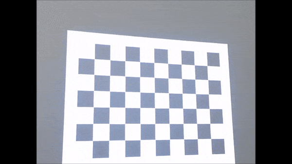
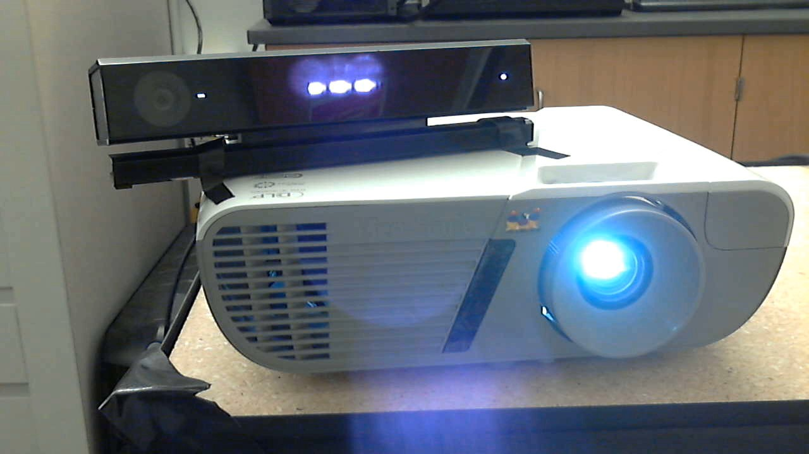
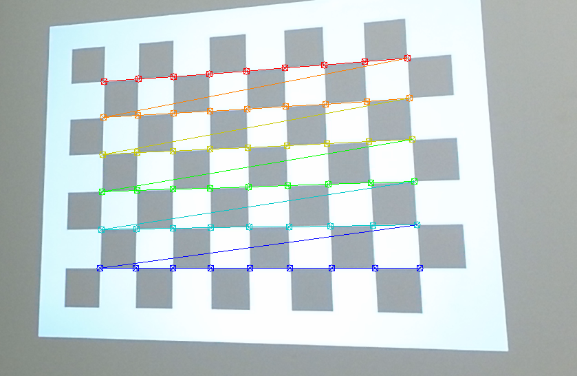
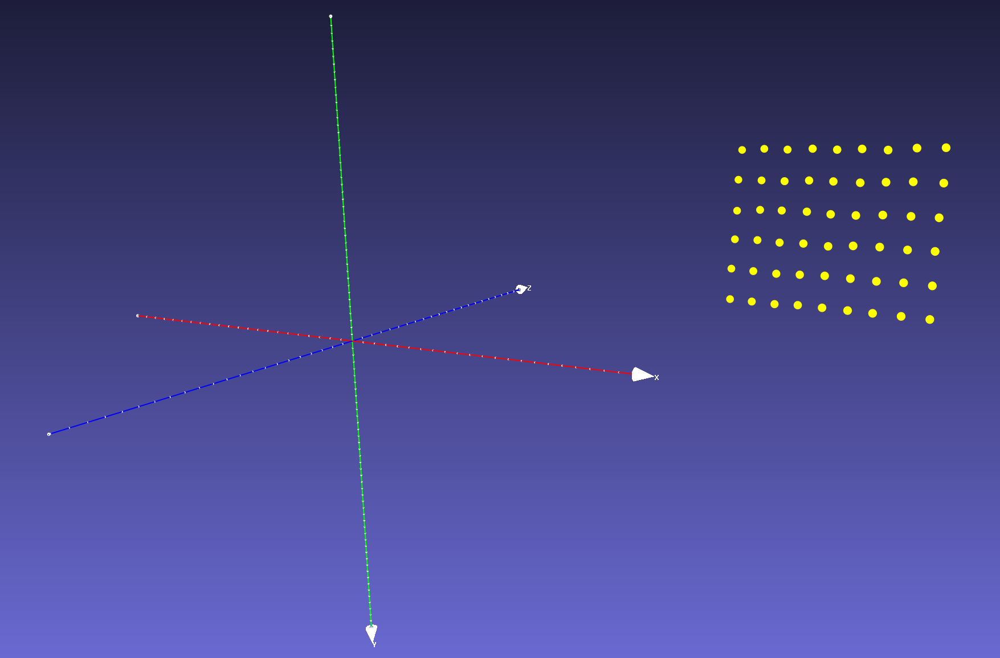
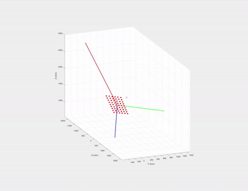
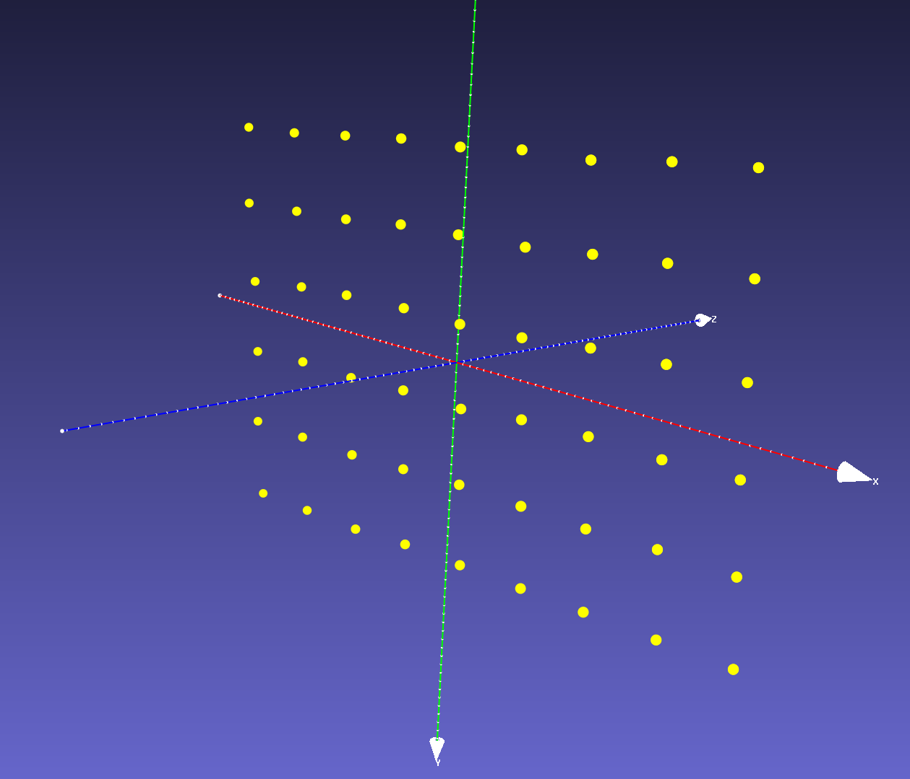

<p align="center"></p>

- [Projected checkerboard image](#projected-checkerboard-image)
- [Getting the 3D-2D coordinates of the checkerboard corners](#getting-the-3d-2d-coordinates-of-the-checkerboard-corners)
- [Rotate 3D points using eigenvectors](#rotate-3d-points-using-eigenvectors)
- [Geometric interpretation of eigenvectors and Singular Value Decomposition (SVD)](#geometric-interpretation-of-eigenvectors-and-singular-value-decomposition-svd)
- [Projector and Kinect depth camera extrinsics](#projector-and-kinect-depth-camera-extrinsics)


We want to combine Microsoft Kinect and a projector to create cool [Augmented Reality (AR) applications](http://genekogan.com/works/kinect-projector-toolkit/), one prerequisite is system calibration. Existing methods, such as [RGBDdemo][1] and [KinectProjectorToolkit][2] either requires printed checkerboard patterns or a large room to calibrate Kinect depth/color cameras and a projector. 

In most simple AR applications, the relative rotation and translation between the Kinect and the projector are fixed. As shown below, we bind them such that their FOVs overlap. 

<p align="center"></p>

In this article, we show that the system can be calibrated using  [Zhang's method][5] without a printed checkerboard pattern or a large room. Instead, we **project** a checkerboard pattern to a white flat wall, then move the bound  Kinect-projector pair to capture mages from at least three different poses, as shown in the teaser image.

In the rest of the article, we focus on calibrating the **intrinsic parameters of the projector** and the **extrinsic parameters between the projector and the Kinect depth camera**. The intrinsics of the Kinect color/depth cameras can either be obtained from Kinect Windows SDK or calibrated using a printed checkerboard.

### Projected checkerboard image

We first generate a checkerboard image pattern using OpenCV:

```c++
Mat generateCheckerboardImg(Size imgSize, Size boardSize, vector < Point2f > & cbPts2d) {
  int offset = 50; // opencv requires white boarders around checkerboard pattern

  // checkerboard image
  Mat imgCheckerboard(imgSize, CV_8UC3, Scalar::all(255));

  // block size
  int squareWidth = floor((imgSize.width - 2 * offset) / boardSize.width);
  int squareHeight = floor((imgSize.height - 2 * offset) / boardSize.height);

  // block color
  unsigned char color = 1;

  //! The order must be consistent with OpenCV order: 
  //row first then column, each row sweep from left to right
  for (int y = offset; y < imgSize.height - offset; y = y + squareHeight) {
    color = ~color;
    if (y + squareHeight > imgSize.height - offset) {
      break;
    }
    for (int x = offset; x < imgSize.width - offset; x = x + squareWidth) {
      color = ~color;
      if (x + squareWidth > imgSize.width - offset) {
        break;
      }
      // save checkerboard points
      if (x > offset && y > offset) {
        cbPts2d.push_back(Point2f(x, y));
      }
      // color the block
      Mat block = imgCheckerboard(Rect(x, y, squareWidth, squareHeight));
      block.setTo(Scalar::all(color));
    }
  }
  return imgCheckerboard;
}
```
*The code is inspired by [Haris][3]*

where `boardSize` contains the number of squares in row and column, `cbPts2d` stores a list of inner corners of the checkerboard and is given by:

$$ \mathbf{P}^{\text{2d}}_{\text{p}} = [ \mathbf{q}_0, \mathbf{q}_1,\dots \mathbf{q}_i, \dots \mathbf{q}_{N-1} ] $$

where $\mathbf{q}_i = [ u_i, v_i ]$ is the 2D coordinate of the $i^\text{th}$ checkerboard corner in the projector image space and *N = `boardSize.width`\*`boardSize.height`*.

The generated checkerboard image is shown below, since OpenCV [findChessboardCorners][6] requires **white boarders** around the checkerboard pattern, we need to add offset to both x and y directions

<p align="center"></p>

Then we project this checkerboard to a white flat wall and in the meanwhile, capture a depth and a color frame of the projected checkerboard pattern using the Kinect. Note we need at least 3 different poses for [Zhang's method][5].

### Getting the 3D-2D coordinates of the checkerboard corners
Given a Kinect-captured **color** checkerboard image, we first extract the 2D checkerboard corners $\mathbf{P}^{\text{2d}}\_{\text{c}}$ using OpenCV's `findChessboardCorners`. Then $\mathbf{P}^{\text{2d}}\_{\text{c}}$'s corresponding 3D coordinates in the Kinect **depth camera's view space** can be queried from the Kinect-captured **depth** image using $\mathbf{P}^{\text{2d}}\_{\text{c}}$ and [Kinect Windows SDK v2.0: CoordinateMapper][4]:

$$ \mathbf{P}^\text{3d} = [ \mathbf{x}_0, \mathbf{x}_1,\dots \mathbf{x}_i, \dots \mathbf{x}_{N-1} ] $$

where $\mathbf{x}_i = [ x_i, y_i, z_i ]$ as the corresponding 3D coordinate of $\mathbf{P}^{\text{2d}}\_{\text{c}}[i]$. Note $\mathbf{P}^{\text{2d}}\_{\text{c}}$ is only used to extract $\mathbf{P}^\text{3d}$ from the Kinect-capture **depth** image in this article, but if you want to calibrate Kinect color camera keep $\mathbf{P}^{\text{2d}}\_{\text{c}}$ for [Zhang's method][5].

<p align="center"></p>

Make sure the order of $\mathbf{P}^{\text{2d}}\_{\text{c}}$ in the image above matches the order of those in $\mathbf{P}^\text{3d}$, basically the corner colors represent the order of the points in $\mathbf{P}^{\text{2d}}\_{\text{c}}$, red is the first element in $\mathbf{P}^{\text{2d}}\_{\text{c}}$ vector and dark blue is the last one.

Since $\mathbf{P}^{\text{2d}}\_{\text{p}}$ is given by `generateCheckerboardImg`, now we have the 3D-2D point pairs ($\mathbf{P}^\text{3d}$ and $\mathbf{P}^{\text{2d}}\_{\text{p}}$) to calibrate the projector intrinsics and extrinsics. But if you send the point pairs directly to OpenCV's [calibrateCamera][5], it will raise an exception, because this function requires that the Z values of `objectPoints` to be zeros, i.e., [Zhang's method][5] assumes all `objectPoints` reside on the XY plane of checkerboard's object space, thus the 3x4 projection matrix $\mathbf{K[RT]}$  can be reduced to a 3x3 homography $\mathbf{H}$.

If we plot $\mathbf{P}^\text{3d}$ we can see that although they reside on the same plane, the Z values are nonzero, because $\mathbf{P}^\text{3d}$ are defined in the Kinect **depth camera's view space** rather than the projected checkerboard's object space.

<p align="center"></p>

One may ask *can we just generate the 3D coordinates of these checkerboard corners like what we did to the conventional printed checkerboard?* The answer is no, unlike a printed checkerboard, the projected one is distorted and skewed due to projector's perspective projection. The distortion varies each time we change the projector-Kinect pose in respect to the wall. So each projected checkerboard image on the wall has a different unknown scale and shape (e.g., a diamond).

### Rotate 3D points using eigenvectors
One workaround is to estimate a rotation and translation between the Kinect depth camera's view space and the checkerboard's object space and then transform $\mathbf{P}^\text{3d}$ to the canonical view, so that they reside in the Kinect depth camera's XY plane (centered at the origin). This needs the checkerboard plane parameters. Luckily, since we know that $\mathbf{P}^\text{3d}$ has a planar shape, its parameters can be estimated using one the three methods below:

1. choose any **three non-collinear** points in $\mathbf{P}^\text{3d}$ to calculate the plane's normal (i.e., Z axis direction) and X, Y axes directions in the checkerboard's object space.
2. use **all** the points in $\mathbf{P}^\text{3d}$ to fit a plane by minimizing the least squares error, this will give us plane normal (Z direction). Then choose any two points in $\mathbf{P}^\text{3d}$ to calculate X (or Y) axis direction and the other axis is the cross product of normal and X (or Y), i.e., Y = `cross`(X, Z).
3. use the eigenvectors of $\mathbf{P}^\text{3d}$'s covariance matrix as the plane's XYZ axes.

Here are the pros and cons. For method 1, which three points should we choose to estimate the plane? The same question applies to method 2 too, which two points should we use to estimate X (or Y) axis? We prefer method 3 since it considers all points in $\mathbf{P}^\text{3d}$ and it is simpler.

### Geometric interpretation of eigenvectors and Singular Value Decomposition (SVD)

If we draw the eigenvectors (their magnitudes are just the corresponding eigenvalues) of $\mathbf{P}^\text{3d}$'s covariance matrix, what are the directions of the three eigenvectors? 

<p align="center"></p>

The first two must be on the checkerboard plane and **the third one is the normal of the plane**! Let us recall **eigen decomposition**, denote $\mathbf{P}^\text{3d}$'s covariance matrix as:

$$\mathbf{\Sigma} = (\mathbf{x}_i - \bar{\mathbf{x}})(\mathbf{x}_i - \bar{\mathbf{x}})^{T}, \quad \text{where}\ \mathbf{x}_i \in \mathbf{P}^\text{3d},\quad \bar{\mathbf{x}} = \mathbb{E}[\mathbf{P}^\text{3d}]$$

The eigen decomposition of $\mathbf{\Sigma}$ is given by:
$\mathbf{\Sigma} = \mathbf{U}\mathbf{S}^{2}\mathbf{U}^T$, where the diagonal of $\mathbf{S}^{2}$ are eigenvalues and $\mathbf{U}$'s columns are the eigenvectors of $\mathbf{\Sigma}$ and **they are also the left singular vectors of $(\mathbf{x}_i - \bar{\mathbf{x}})$**. 

So instead of computing an expensive covariance matrix, we compute eigenvectors using SVD by:
1. Obtain $\bar{\mathbf{x}}$ by
$\bar{\mathbf{x}} = \mathbf{C}\mathbf{P}^\text{3d}$, where $\mathbf{C} = \mathbf{I} - \frac{\mathbf{O}}{n}$ is a [centering matrix][8]. If we plot $\bar{\mathbf{x}}$ we will find it is just $\mathbf{P}^\text{3d}$ translated and centered to the origin of the Kinect's depth camera's view space.
2. Apply SVD to $\bar{\mathbf{x}}$:  $\mathbf{U}\mathbf{S}\mathbf{V}^T = \bar{\mathbf{x}}$. 
3. Afterwards, to rotate $\bar{\mathbf{x}}$ to the XY plane of Kinect depth camera's view space, we only need to left multiply $\mathbf{U}^{-1}$, i.e.,  $\mathbf{U}^{T}$ to $\bar{\mathbf{x}}$.  Then we have $\mathbf{P}^\text{3d}\_{\text{obj}} = \mathbf{U}^{T}\bar{\mathbf{x}}$, and $\mathbf{P}^\text{3d}\_{\text{obj}}$ is almost aligned with XY plane.
4. Due to projector and Kinect sensor noise and nonplanarity of the wall, the translated and rotated $\mathbf{P}^\text{3d}\_{\text{obj}}$ may have very small Z values, we can orthogonally project $\mathbf{P}^\text{3d}\_{\text{obj}}$ to the XY plane by setting the Z coordinate of $\mathbf{P}^\text{3d}\_{\text{obj}}$ to 0, the final $\mathbf{P}^\text{3d}\_{\text{obj}}$ is shown in the image below.

<p align="center"></p>


Note in step 3, we do not constrain the signs of eigenvectors since they do not affect the projector **intrinsics** calibration.

Finally, we have $\mathbf{P}^{\text{3d}}_{\text{obj}}$, the 3D coordinates in the checkerboard's object space and $\mathbf{P}^{\text{2d}}\_{\text{p}}$, the corresponding 2D coordinates in the projector image space  to calibrate the projector intrinsics using [calibrateCamera][5].

### Projector and Kinect depth camera extrinsics
We can also obtain the relative rotation and translation $\mathbf{RT}$ between the Kinect depth camera and the project by sending the calibrated projector intrinsics, the known [Kinect depth camera intrinsics][4], the 3D coordinates of checkerboard corners $\mathbf{P}^{\text{3d}}\_{\text{obj}}$, the 2D coordinates of checkerboard corners in projector image $\mathbf{P}^{\text{2d}}\_{\text{p}}$ and the 2D checkerboard corners in the Kinect depth camera image $\mathbf{P}^\text{2d}\_\text{d}$ to OpenCV function [stereoCalibrate][7]. 

The calibrated projector intrinsic projection matrix

$$
\mathbf{K}_\text{p} =
\begin{array}{|l|l|l|}
\hline
1227.8 & 0      & 450.9 \\ \hline
0      & 1214.9 & 606.1 \\ \hline
0      & 0      & 1     \\ \hline
\end{array}
$$

projector distortion coefficients

$$
\mathbf{Kc}_\text{p} = 
\begin{array}{|l|l|l|l|l|}
\hline
 -0.1708 & 1.0518 & -0.0168 & 0.0065 & -2.8967 \\ \hline
\end{array}
$$

projector-camera extrinsics

$$
\mathbf{RT} =
\begin{array}{|l|l|l|l|}
\hline
\mathbf{r}_1     & \mathbf{r}_2     & \mathbf{r}_3      & \mathbf{t} (\text{mm})   \\ \hline
0.9435 & -0.061 & -0.3256 & 177.72   \\ \hline
-0.004 & 0.9807 & -0.1953 & -92.0386 \\ \hline
0.3312 & 0.1856 & 0.9251  & -21.0593 \\ \hline
\end{array}
$$

___
[1]:http://rgbdemo.org/index.php/Documentation/TutorialProjectorKinectCalibration
[2]:https://github.com/genekogan/KinectProjectorToolkit
[3]:http://answers.opencv.org/question/27917/how-to-create-a-chess-board/?answer=27943#post-id-27943
[4]:https://msdn.microsoft.com/en-us/library/windowspreview.kinect.coordinatemapper.aspx
[5]:https://docs.opencv.org/2.4/modules/calib3d/doc/camera_calibration_and_3d_reconstruction.html#calibratecamera
[6]:https://docs.opencv.org/2.4/modules/calib3d/doc/camera_calibration_and_3d_reconstruction.html#findchessboardcorners
[7]:https://docs.opencv.org/3.0-beta/modules/calib3d/doc/camera_calibration_and_3d_reconstruction.html#stereocalibrate
[8]:https://en.wikipedia.org/wiki/Centering_matrix
