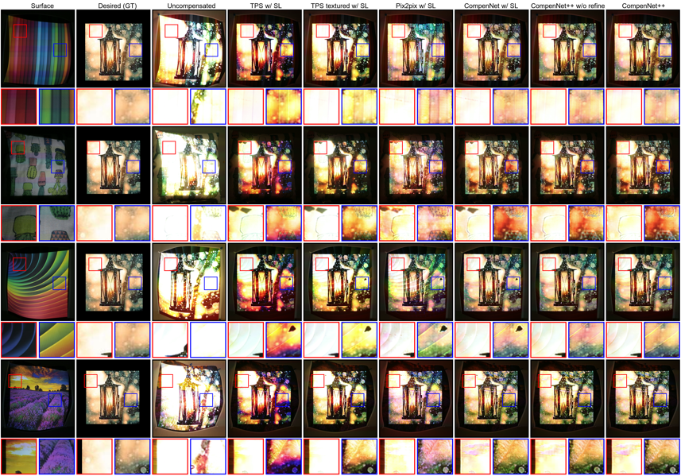

### Bingyao Huang and [Haibin Ling](https://www3.cs.stonybrook.edu/~hling)
### ICCV 2019
### [[Paper](http://openaccess.thecvf.com/content_ICCV_2019/papers/Huang_CompenNet_End-to-End_Full_Projector_Compensation_ICCV_2019_paper.pdf)]  [[Supp. material](https://www3.cs.stonybrook.edu/~hling/publication/CompenNet++_sup-high-res.pdf)]  [[GitHub](https://github.com/BingyaoHuang/CompenNet-plusplus)]

<!-- teaser -->

## Abstract
Full projector compensation aims to modify a projector input image such that it can compensate for both geometric and photometric disturbance of the projection surface. Traditional methods usually solve the two parts separately, although they are known to correlate with each other. In this paper, we propose the first end-to-end solution, named CompenNet++, to solve the two problems jointly. Our work non-trivially extends CompenNet, which was recently proposed for photometric compensation with promising performance. First, we propose a novel geometric correction subnet, which is designed with a cascaded coarse-to-fine structure to learn the sampling grid directly from photometric sampling images. Second, by concatenating the geometric correction subset with CompenNet, CompenNet++ accomplishes full projector compensation and is end-to-end trainable. Third, after training, we significantly simplify both geometric and photometric compensation parts, and hence largely improves the running time efficiency. Moreover, we construct the first setup-independent full compensation benchmark to facilitate the study on this topic. In our thorough experiments, our method shows clear advantages over previous arts with promising compensation quality and meanwhile being practically convenient.

___
## Network Architecture

___
## Qualitative Comparisons

___
## Related Work
* Bingyao Huang and Haibin Ling. **End-to-end Projector Photometric Compensation**. CVPR. 2019. [[Paper](http://openaccess.thecvf.com/content_CVPR_2019/papers/Huang_End-To-End_Projector_Photometric_Compensation_CVPR_2019_paper.pdf)]  [[Supp. material](https://www3.cs.stonybrook.edu/~hling/publication/CompenNet_sup.pdf)]  [[GitHub](https://github.com/BingyaoHuang/CompenNet)] [[Webpage]({{site.baseurl}}/compennet)]
* Anselm Grundhöfer and Daisuke Iwai. **Robust, error-tolerant photometric projector compensation**. IEEE TIP. 2015. [[Paper](http://daisukeiwai.org/share/paper/Grundhoefer_TIP15.pdf)]
* Phillip Isola, Jun-Yan Zhu, Tinghui Zhou, and Alexei A. Efros. **Image-to-image translation with conditional adversarial networks**. CVPR. 2017. [[Paper](https://arxiv.org/abs/1611.07004)] [[Webpage](https://phillipi.github.io/pix2pix/)]
* Shree K. Nayar, Harish Peri, Michael D. Grossberg, and Peter N. Belhumeur. **A projection system with radiometric compensation for screen imperfections**. ICCV workshop on projector-camera systems (PROCAMS). 2003. [[Paper](https://www1.cs.columbia.edu/CAVE/publications/pdfs/Nayar_PROCAMS03.pdf)] [[Webpage](https://www.cs.columbia.edu/CAVE/projects/pr_any/)]

___