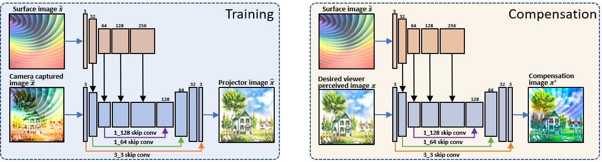

### Bingyao Huang and [Haibin Ling](https://www3.cs.stonybrook.edu/~hling)
### CVPR 2019 oral
### [[Paper](http://openaccess.thecvf.com/content_CVPR_2019/papers/Huang_End-To-End_Projector_Photometric_Compensation_CVPR_2019_paper.pdf)]  [[Supp. material](https://www3.cs.stonybrook.edu/~hling/publication/CompenNet_sup.pdf)]  [[GitHub](https://github.com/BingyaoHuang/CompenNet)]

<!-- teaser -->

## Abstract
Projector photometric compensation aims to modify a projector input image such that it can compensate for disturbance from the appearance of projection surface. In this paper, for the first time, we formulate the compensation problem as an end-to-end learning problem and propose a convolutional neural network, named CompenNet, to implicitly learn the complex compensation function. CompenNet consists of a UNet-like backbone network and an autoencoder subnet. Such architecture encourages rich multi-level interactions between the camera-captured projection surface image and the input image, and thus captures both photometric and environment information of the projection surface. In addition, the visual details and interaction information are carried to deeper layers along the multi-level skip convolution layers. The architecture is of particular importance for the projector compensation task, for which only a small training dataset is allowed in practice. Another contribution we make is a novel evaluation benchmark, which is independent of system setup and thus quantitatively verifiable. Such benchmark is not previously available, to our best knowledge, due to the fact that conventional evaluation requests the hardware system to actually project the final results. Our key idea, motivated from our end-to-end problem formulation, is to use a reasonable surrogate to avoid such projection process so as to be setup-independent. Our method is evaluated carefully on the benchmark, and the results show that our end-to-end learning solution outperforms state-of-the-arts both qualitatively and quantitatively by a significant margin.

___
## Network Architecture

___
## Qualitative Comparisons

___
## Related Work
* Bingyao Huang and Haibin Ling. **CompenNet++: End-to-end Full Projector Compensation**. ICCV. 2019. [[Paper](http://openaccess.thecvf.com/content_ICCV_2019/papers/Huang_CompenNet_End-to-End_Full_Projector_Compensation_ICCV_2019_paper.pdf)]  [[Supp. material](https://www3.cs.stonybrook.edu/~hling/publication/CompenNet++_sup-high-res.pdf)]  [[GitHub](https://github.com/BingyaoHuang/CompenNet-plusplus)] [[Webpage]({{site.baseurl}}/compennet++)]
* Anselm Grundhöfer and Daisuke Iwai. **Robust, error-tolerant photometric projector compensation**. IEEE TIP. 2015. [[Paper](http://daisukeiwai.org/share/paper/Grundhoefer_TIP15.pdf)]
* Phillip Isola, Jun-Yan Zhu, Tinghui Zhou, and Alexei A. Efros. **Image-to-image translation with conditional adversarial networks**. CVPR. 2017. [[Paper](https://arxiv.org/abs/1611.07004)] [[Webpage](https://phillipi.github.io/pix2pix/)]
* Shree K. Nayar, Harish Peri, Michael D. Grossberg, and Peter N. Belhumeur. **A projection system with radiometric compensation for screen imperfections**. ICCV workshop on projector-camera systems (PROCAMS). 2003. [[Paper](https://www1.cs.columbia.edu/CAVE/publications/pdfs/Nayar_PROCAMS03.pdf)] [[Webpage](https://www.cs.columbia.edu/CAVE/projects/pr_any/)]

___
